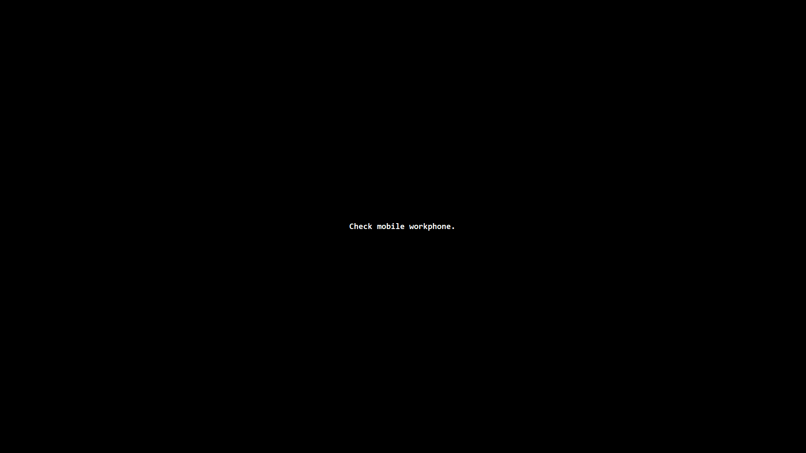

[](https://github.com/MircoBabin/DoNotForget-Message/releases)
[](https://github.com/MircoBabin/DoNotForget-Message/blob/master/LICENSE.md)

# Do Not Forget Message
It's purpose is to display a message fullscreen on the primary monitor. To be notified that some action should be performed. The message can be closed with the ESC key.



# Download binary
For Windows (.NET framework 4), [the latest version can be found here](https://github.com/MircoBabin/DoNotForget-Message/releases/latest "Lastest Version").

Download the zip and unpack it somewhere.

The minimum .NET framework required is 4.0.

# Help

Execute **DoNotForget-Message.exe** without parameters to view the help.

Specify the message on the commandline:
```
DoNotForget-Message.exe "Message to display\nNext line, \n denotes a newline"
```

Specify the message via a file (the file must be UTF-8 encoded):
```
DoNotForget-Message.exe "c:\utils\MyMessage.txt"
```

# Why
During the day I get some notification via Skype, email, ... that I can't be reached on the mobile workphone. Then I check the phone and see the battery is empty. To prevent this situation I want to get a fullscreen notification after I login into Windows to "Check mobile workphone.". And charge the phone before someone wants to call me.

Via Windows Taskscheduler I have a task "after logon" to run: DoNotForget-Message.exe "Check mobile workphone."

# Contributions
Contributions are welcome. Please read [CONTRIBUTING.md](CONTRIBUTING.md "contributing") before making any contribution!

# License
[The license is MIT.](LICENSE.md "license")


